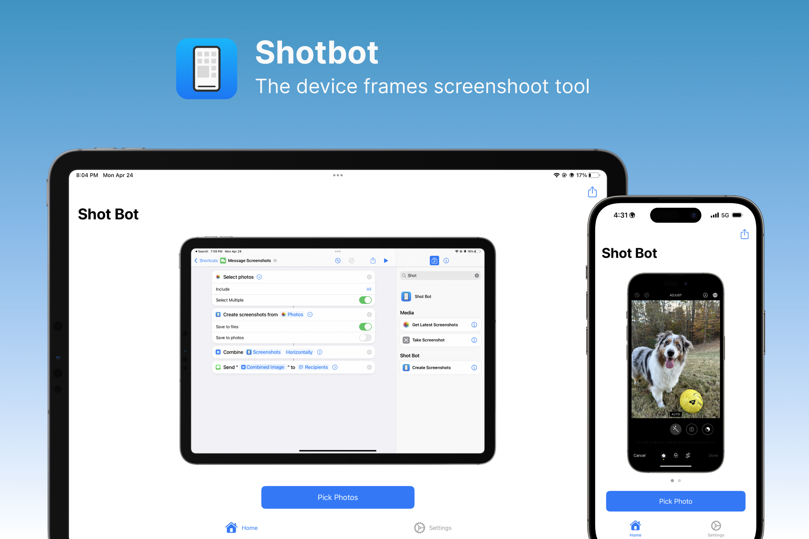

# ShotBot

Shot Bot is an iOS and Mac app for framing screenshots inspired by [Apple Frames](https://www.macstories.net/stories/apple-frames-3-1-extending-screenshot-automation-with-the-new-apple-frames-api/) from [Federico Viticci](https://www.macstories.net/author/viticci/). He is constantly pushing the Shortcuts app to its limit, but I felt like it was time to create a dedicated app for device frames.

The goal of this project is to provide an open source alternative to using his Apple Frames shortcut. By having a powerful, light, and intuitive native app I hope to get more people not only framing screenshots, but to ease them into using the shortcuts app. Although ShotBot is a native app, it will have first class shortcut support. This along with other native technologies such as drag & drop, widgets, share extensions, and much more will make this the go to screenshooting tool in the future.
